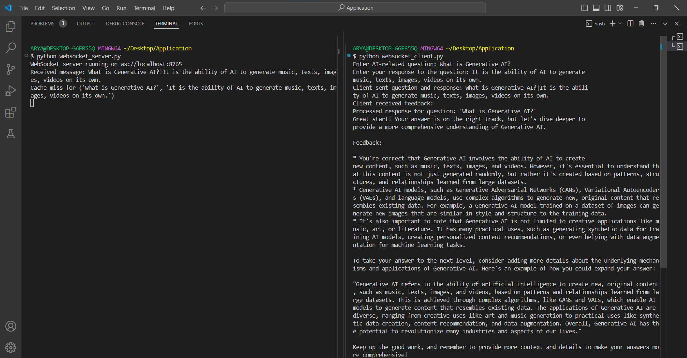
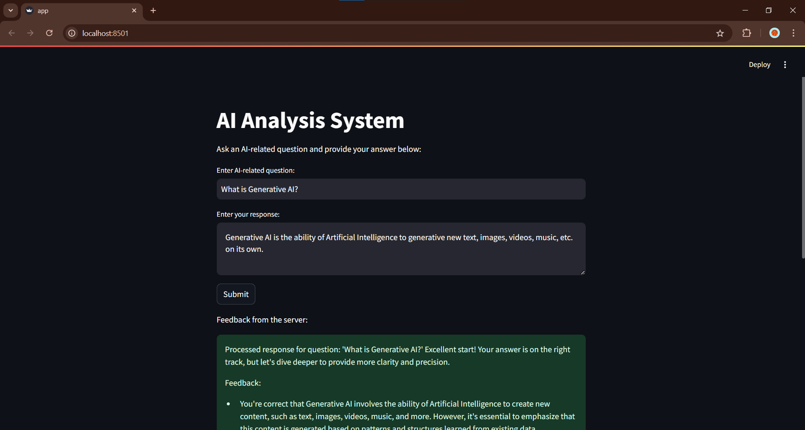

# AI-Analysis-System

## Overview
This project is designed to simulate a learning system where students can submit their answers to AI-related questions. Based on the answers, feedback is provided by the server using a WebSocket-based communication system. The server compares the answers to predefined correct answers and provides feedback with a score. Additionally, we have integrated GroqLLM, a powerful language model, to enhance the feedback generation process, making it more advanced and accurate.

### Purpose:
The goal of this project is to provide an interactive AI-based feedback system that helps students learn and improve their understanding of specific AI topics by generating real-time feedback based on their responses.

### Technologies Used:

- Python (Version 3.7 or higher)
- WebSockets (for real-time communication)
- GroqLLM (for language model-based feedback generation)
- Unit Testing (unittest, mocking)
- asyncio (For asynchronous operations)

## Software Requirements
- Python 3.7 or higher
- Libraries:
  - `websockets` (for WebSocket communication)
  - `langchain` and `langchain_groq` (for integrating GroqLLM)
  - `unittest` (for unit testing)
  - `asyncio` (for asynchronous operations)

To install the dependencies, use the following command:
```bash
pip install websockets langchain langchain-groq
```

### Hardware Requirements:
No specific hardware requirements; any modern machine capable of running Python should suffice.

## Installation Instructions
Step-by-step guide to set up the project locally.

```bash
/AI Analysis System
    ├── websocket_client.py
    ├── websocket_server.py
    ├── test_analysis_logic.py
    ├── app.py
    ├── requirements.txt
    └── README.md
```
    
**Step 1: Clone the repository**
```bash
git clone https://github.com/arya-io/ai-analysis-system.git
cd ai-analysis-system
```

**Step 2: Install dependencies**
```bash
pip install -r requirements.txt
```

**Step 4: Run the WebSocket Server**

Start the WebSocket server to handle incoming client requests:

```bash
python websocket_server.py
```

**Step 5: Run the WebSocket Client**

On a separate terminal, run the client to interact with the server:

```bash
python websocket_client.py
```

If you are running through Streamlit, run

```bash
streamlit run app.py
```

## Architecture and Design

### System Architecture:

- **Client:** The client interacts with the WebSocket server, sending a question and the user’s answer. It then receives feedback from the server.
- **Server:** The server processes the answer using GroqLLM and predefined correct answers, and then generates feedback. It also caches the feedback to avoid redundant processing.

### Communication Flow:

1. **Client:** Sends a question and response to the server via WebSocket.
2. **Server:** Compares the answer to the predefined correct answer and generates feedback.
3. If the same question and answer have been asked before (cache hit), the feedback is retrieved from the cache.
4. Feedback is sent back to the client via WebSocket.

**LLM Integration:** GroqLLM is used to improve the feedback generation process. The model is invoked to provide more dynamic, contextual feedback for various answers.

## API Endpoints / Usage

### WebSocket Communication:

- **Server URI:** ws://localhost:8765
- **Client Sends:** A message containing a question and an answer separated by |.
- **Server Response:** Feedback based on the similarity between the user’s answer and the correct answer.

**Example Interaction:**

1. **Client sends:**
`"What is a neural network?|A neural network is a computational model inspired by biological neural systems."`

2. **Server responds:**
`"Score: 7/10\nFeedback: Good attempt, but your answer is slightly incomplete or inaccurate. Review the concept."`

## Testing

**Testing Strategy:** The system is tested using the unittest framework. The tests verify the functionality of feedback generation, cache hits/misses, and WebSocket timeout handling.

**How to Run Tests**

To run the tests, simply execute the following:

```bash
python -m unittest test_analysis_logic.py
```
This will run all the test cases and show the results in the terminal.

## Result:
### When run in terminal:

### When run in Streamlit


## Conclusion:
This project provides a real-time interactive system for generating feedback on AI-related questions. By integrating GroqLLM, we were able to enhance the feedback generation process, making it more dynamic and intelligent. The use of WebSockets ensures that communication is fast and efficient, and the caching mechanism further optimizes the system’s performance.

## License
This project is licensed under the MIT License. See the [LICENSE](LICENSE) file for more details.
